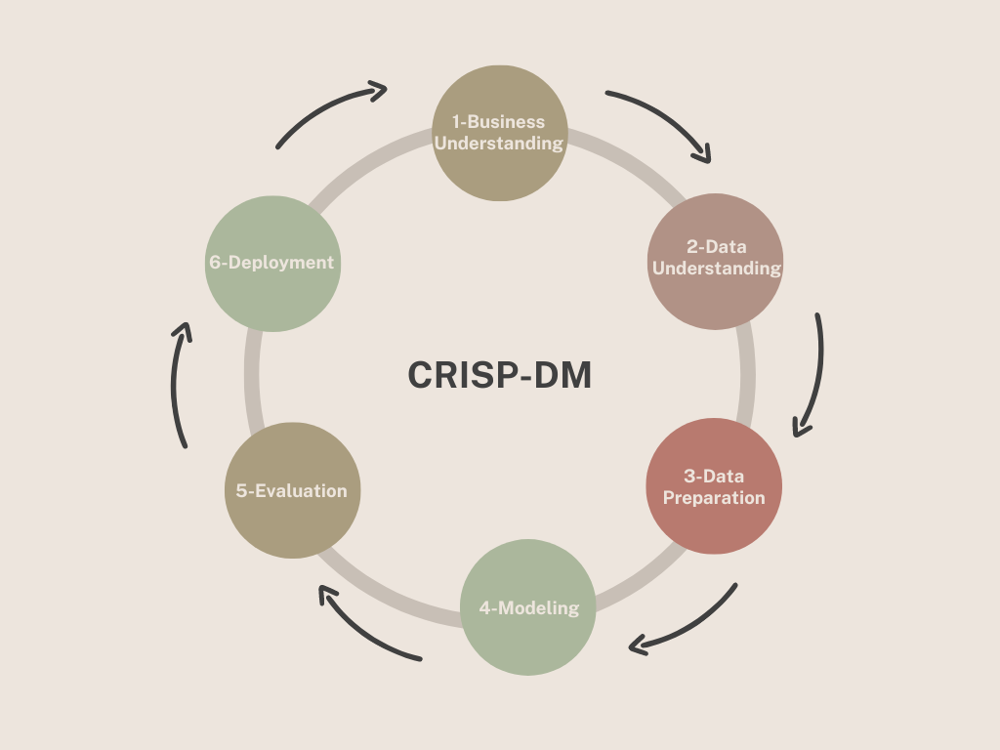
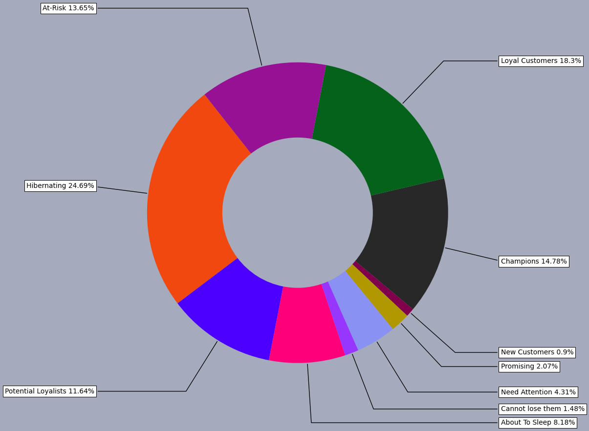
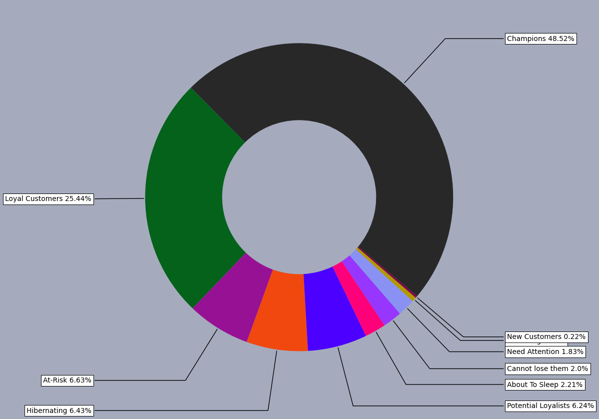
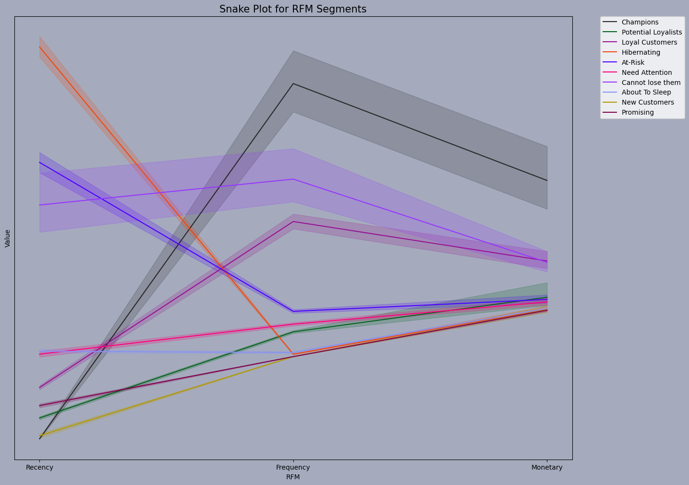
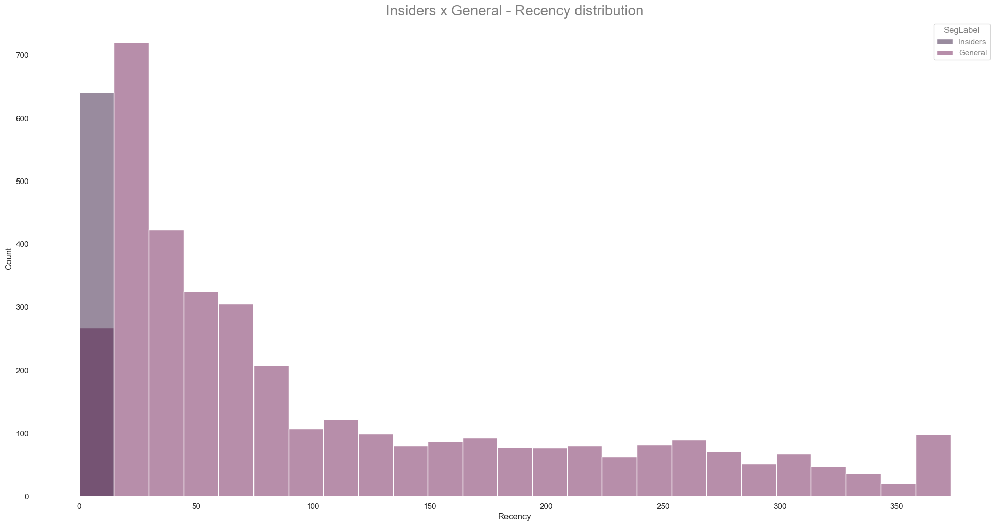
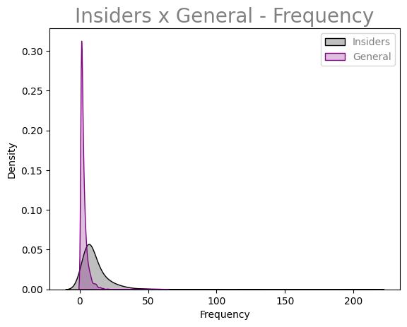
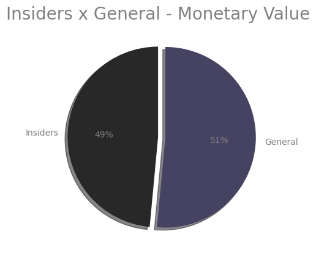
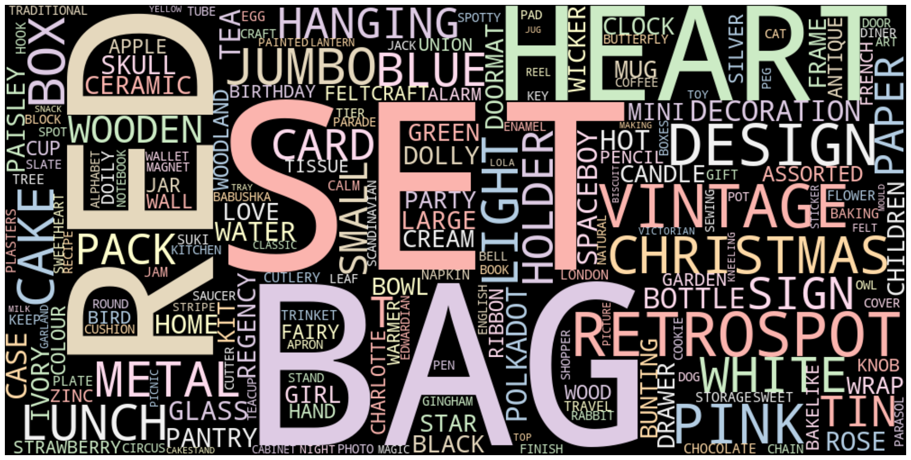
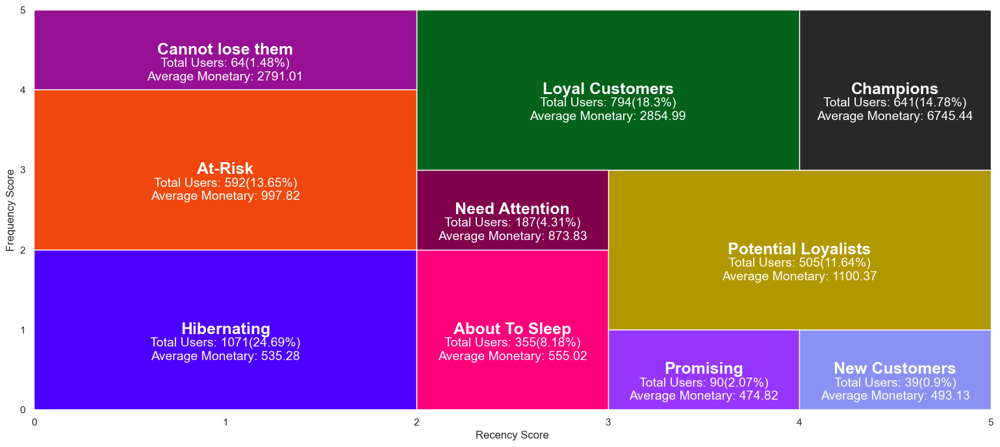

<h1 align="center"> E-commerce Clustering - Loyalty Program</h1>
<h6 align="center"> This project was based on a fictional company</h6>

This is a study project that aim to cluster customers of an e-commerce, to begin an loyalty program.

On the first cycle of the solution, based on CRISP method, the result was a RFM Analysis. 

&nbsp; 

----------------------------

**<h2> 1 - Business Problem </h2>**

**<h2> 1.1 - About BigBox </h2>**

At BIGBox, a multi-brand e-commerce company, the marketing team realized that some customers buy more expensive products with high frequency and end up contributing a significant portion of the company's revenue. Based on this perception, the marketing team will launch a loyalty program for the best customers in the base, called **Insiders**. 

&nbsp; 

**<h2> 1.2 - The business problem </h2>**

The marketing team does not have advanced knowledge in data analysis to select program participants. For this reason, the data team will select eligible clients for the program, using advanced data manipulation techniques.

The data scientist team at BigBox, will need to determine which customers are eligible to participate in **Insiders**. In possession of this list, the Marketing team will carry out a sequence of personalized and exclusive actions for the group, in order to increase revenue and purchase frequency.

&nbsp; 

-------------------

**<h2> 2 - Solution Strategy </h2>**
In this project will be used the Cross Industry Standard Process for Data Mining or CRISP-DM is an open standard process framework model for data mining project planning.

As a result of the first solution cycle, the solution was a customer segmentation model based on Recency, Frequency and Monetary Value - RFM Analysis.

&nbsp; 

-------------------

**<h2> RFM Analysis </h2>**

RFM is a powerful technique for segmenting customers based on how engaged they are with the business. It provides valuable insights into customer behavior by looking at how long ago they made a purchase, how often they shop, and how much they spend. By assigning scores to each of these factors and grouping customers into segments, companies can tailor their marketing efforts to specific customer groups and improve overall customer engagement and loyalty.

The distribution of the customers based on RFM Analysis was:

With this graph, it can be seen that:

* The groups **Hibernating** and **At Risk** correspond to just over 38%, which suggests attention to these groups.
* 18,3% of the customers has potential of, in the future, become Insiders.
* The **Champions** group, that will be the insiders, represent 14,78% of the customers. 

&nbsp; 

Analyzing the monetary distribution, based on the RFM analysis, it is observed that:

* Despite being only 14% of customers, the **Champion** group represents almost 50% of revenue.
* The groups **Hibernating** and **At Risk** represents almost 15%, which confirms the need for focused action.

&nbsp; 

**ANALYSIS**

**<h2> Insiders Analysis </h2>**

Looking more specifically at the **Insiders Group**, some analyzes will be described below.

**<h2> RFM Table </h2>**

The graphic representation of it was:

| Customer Segment         | Activity                                                                                  | What to do                                                                                                    |
|--------------------------|-------------------------------------------------------------------------------------------|---------------------------------------------------------------------------------------------------------------|
| Champions                | Recently purchased, frequent buyers, high spenders                                        | Reward them. They can be early adopters of your new products. They will promote your brand.                  |
| Loyal Customers          | High spenders, frequent buyers. Respond well to promotions                                | Offer higher-value products (upsell). Ask for reviews. Engage them.                                          |
| Potential to be Loyal    | Recently purchased, spent a good amount, and made multiple purchases                      | Offer a loyalty program and recommend other products.                                                        |
| Recent Customers         | Recently purchased but with low frequency                                                 | Start building a relationship, offer support, deliver value quickly.                                          |
| Promising Customers      | Recently purchased but spent very little                                                  | Engage them with your brand, offer free trials.                                                                |
| Customers Needing Attention | High frequency and high spenders, but it's been a while since their last purchase         | Reactivate them, offer limited-time deals on similar products they previously purchased.                      |
| Almost Hibernating       | High frequency and high spenders, but it's been a LONG time since their last purchase    | Offer great and popular products, discounts. Reconnect!                                                       |
| At Risk                  | High frequency and high spenders, but it's been a VERY LONG time since their last purchase | Send personalized emails, SMS, and messages, offer useful products.                                           |
| Can't Lose Them          | High frequency and high spenders, but it's been even longer since their last purchase    | Win them back with new products, have conversations with them.                                                |
| Hibernating              | Last purchase was a long time ago, spent little, and made few purchases                   | Offer relevant products with special discounts. Recreate value with the brand.                               |

